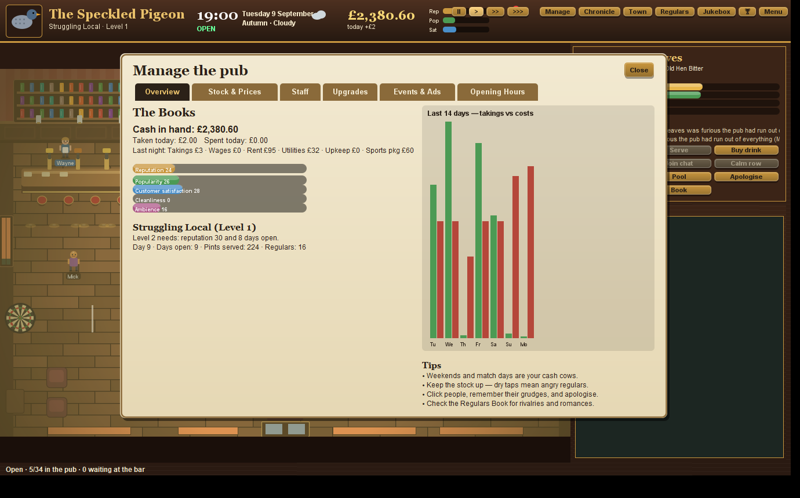

# 🍺 British Pub Simulator

A chaotic, cosy, surprisingly deep life-and-management sim set in **The Speckled Pigeon**, a slightly worn local pub in the fictional town of Westbridge.
You're the landlord. The pub lives whether you're watching or not: sixteen regulars with their own jobs, moods, memories, grudges, crushes, secrets and opinions
argue about football, gossip, fall in love, fall out, buy rounds, play darts and pool, and occasionally lock themselves in the toilet.

Written in plain **Java (Swing / Java2D)** — no dependencies, no build tool, all sound synthesised in code.




## Play

Needs a JDK 17 or newer (developed on JDK 25).

```
build.bat      (Windows)   or   ./build.sh
play.bat                   or   java -jar PubSimulator.jar
```

No jar? `javac -encoding UTF-8 -d out src/pub/*.java && java -cp out pub.Main`

## How to play

* **Move**: click the floor, or WASD / arrows. **Click a person** to select them (double-click to talk). Customers with an amber **!** are waiting at the bar —
  click them to serve instantly, or stand behind the bar (top-left) and you'll pull pints automatically. Staff serve too.
* **Side card actions**: Talk (real choices with consequences), Serve, Buy a drink, Gossip, Join chat, Calm a row, Darts, Pool, Apologise, Throw out.
* **Click things**: the TV (live fictional football + league table), jukebox, dartboard, pool table, notice board (what's on this week), kitchen, fruit machine, spills (mop them!), the pigeon.
* **Hotkeys**: `Space` pause · `1/2/3` speed · `M` manage · `N` newspaper · `T` town · `B` regulars book · `J` jukebox · `F5` save · `Esc` menu.

## What's in it

* **A living pub** — customers decide for themselves when to arrive, what to drink, where to sit, who to talk to, when to play darts or pool, when to
  watch the match, when to go to the loo, and when to leave. Out of the pub they have lives in **Westbridge** (work, shops, the Frog & Trumpet, the stadium…) — see the Town map.
* **Memory & relationships** — arguments, laughs, favours, snubs and gossip are remembered, referred back to ("I haven't forgotten our row on Tuesday") and passed around by Linda.
  Friendships, rivalries, crushes, couples, break-ups, running jokes, secrets that leak, regulars who defect to the rival pub or become lifelong locals.
* **Conversations** — topic-driven small talk that agrees, disagrees, misunderstands, interrupts, changes subject, flirts, brags (Gaz, every ~17 minutes) and escalates into rows.
* **Football** — a fictional league with live matches on the pub telly, goal reactions, spilled pints, chants, gloating, people storming out, spoken commentary (Windows); match days are huge.
* **Playable activities** — real darts (301 with a swaying reticle), real pool physics, a pub quiz against rival teams, a karaoke rhythm game, a jukebox of synthesised songs that customers react to.
* **Management** — stock & ordering, price setting (customers notice), hiring/firing staff with personalities, opening hours, upgrades, decor, advertising, bookings (karaoke / live band / beer festival / charity), reputation, popularity and satisfaction, five pub levels, 45 achievements.
* **30+ random events** — locked in the loo, power cuts, TV dying mid-match, a pigeon heist, a celebrity, proposals, stag dos, a rival pub opening, police misunderstandings, ridiculous bets, a mystery Friday regular with a secret…
* **Storylines that emerge** — a struggling customer asks for a job, becomes a brilliant bartender, then something happens. Two football rivals become friends. A regular goes missing. The pigeon gets a name.
* **The Westbridge Chronicle** — a newspaper reporting what actually happened in your pub, plus the odd mystery pigeon story.
* **Saving** — autosaves hourly and nightly (`~/.speckled-pigeon/`).

## Code map

`src/pub/` — `Sim` (clock/state/day cycle), `Ai` (customer behaviour), `Social` (conversation, memory, gossip, bonds), `Football`, `Events` (random events & storylines),
`Mgmt` (economy, staff, upgrades, achievements), `Nav` (layout & A* pathfinding), `Gfx` (renderer), `Audio` (synth), `Games` (darts/pool/quiz/karaoke),
`Screens` / `GameWindow` / `UI` (interface), `Soak` (developer stress test: `java -cp out pub.Main --soak 30`).

Developer flags: `--shot file.png --day N --hour H [--screen manage|news|town|book|darts|pool|quiz|karaoke|…]` renders a frame and exits.
